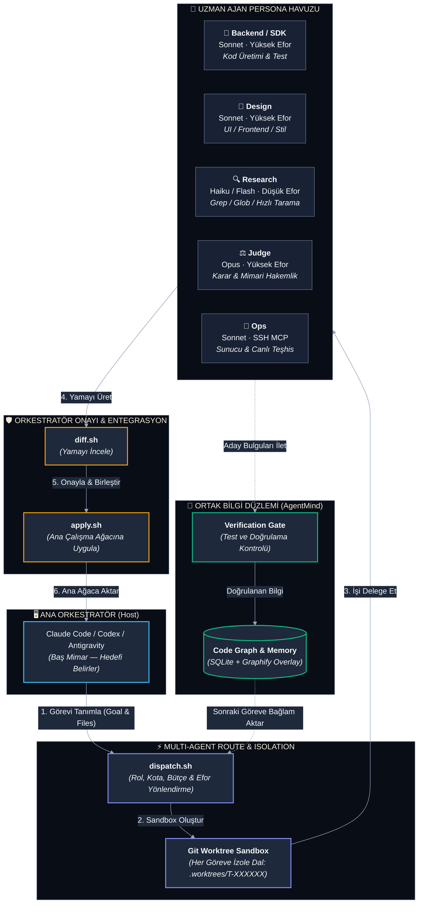

# ⚡ Model Dispatch Route

> **Otonom Orkestratörler (Claude Code, Codex, Antigravity) için Bütçeli, İzole ve Doğrulamalı Çoklu Ajan (Multi-Agent) Yönlendirme Motoru**

[](LICENSE)
[](https://www.python.org/)
[](#-multi-agent-mimari-ve-roller)
[](https://github.com/MSelcukAkbas/model-dispatch-route/actions)

---

## 🎯 Temel Felsefe: Neden Multi-Agent Dispatch?

Karmaşık yazılım projelerinde tek bir modelin her işi yapmaya çalışması üç büyük darboğaz yaratır:
1. **Bağlam Şişmesi (Context Bloat):** Tek bir oturuma binlerce satır kod yüklendiğinde modelin odaklanma ve muhakeme kalitesi düşer.
2. **Kota ve Maliyet Patlaması:** Basit bir kod arama veya dosya tarama için en pahalı modelin token kotasını harcamak kaynak israfıdır.
3. **Doğrudan Müdahale Riski:** Bir alt ajanın ana çalışma dizininde doğrudan `git commit` veya kontrolsüz dosya değişiklikleri yapması projeyi bozabilir.

**Model Dispatch Route**, ana orkestratörü (Claude Code / Codex / Antigravity) bir **"Baş Mimar"** konumuna yerleştirir:
- 🔀 **Uzman Ajanlara Görev Delege Etme:** İşin niteliğine göre en uygun model ve efor seviyesi seçilir (kodlama için Sonnet, derin analiz için Opus, hızlı tarama için Haiku/Flash).
- 🛡️ **İzole Git Worktree Alanı:** Her alt ajan bağımsız bir Git worktree içinde çalışır. Ana çalışma dizininize doğrudan dokunamaz.
- 🔍 **Orkestratör Kontrolünde Birleştirme:** Alt ajanın ürettiği değişiklikler önce `diff.sh` ile incelenir, orkestratör onay verirse `apply.sh` ile ana dala uygulanır.
- 🧠 **AgentMind Paylaşımlı Hafıza Çekirdeği:** Ajanlar arası bilgi aktarımı sağlar; üretilen bulguları kod grafına (Graphify) mühürler ve testlerden geçmeyen iddiaları doğrulanmış saymaz (`Verification Gate`).

---

## 🏗️ Sistem Mimarisi

Aşağıdaki şema, bir görevin ana orkestratörden çıkıp alt ajanlar tarafından işlenmesini ve güvenle ana depoya dahil edilmesini gösterir:



---

## 🤖 Multi-Agent Rol Matrisi

Model Dispatch Route, görevleri rastgele bir modele göndermek yerine her rolün yetki ve kaynak sınırlarını katı kurallarla belirler:

| Rol | Varsayılan Model | Yetki Sınırları | Efor Seviyesi | Kullanım Alanı |
|---|---|---|---|---|
| **`backend`** | Sonnet | Tam Yazma / Terminal | `high` | Çekirdek iş mantığı, API geliştirme, birim testleri |
| **`design`** | Sonnet | Tam Yazma | `high` | UI/UX, CSS, bileşen düzenlemeleri, görsel estetik |
| **`sdk`** | Sonnet | Tam Yazma | `high` | Harici kütüphane, SDK ve istemci kodları |
| **`research`** | Haiku / Flash | **Salt Okunur** (Read / Grep / Glob) | `low` | Büyük depolarda hızlı kod tarama, referans arama (çok ucuz) |
| **`judge`** | Opus | **Salt Okunur** (Karar Odaklı) | `high` | Kritik mimari kararlar, çelişki çözümü, tasarım incelemesi |
| **`ops`** | Sonnet | SSH MCP / Terminal (Dosya Yazma Yok) | `high` | Uzak sunucu teşhisi, konteyner yönetimi, canlı ortam kontrolleri |
| **`general`** | Sonnet | Tam Yazma | `medium` | Dokümantasyon, konfigürasyon, görev takip dosyaları |

---

## ⚡ Multi-Agent Çalışma Akışı (Lifecycle)

### 1. Görevi Hazırlayın (`prompt.md`)
Her görevin en başında **tek bir net hedef** ve isteğe bağlı **hedef dosyalar** tanımlanır:
```markdown
# GOAL: Auth middleware'ine JWT token doğrulama mantığını ekle ve testlerini yaz
# FILES: src/middleware/auth.ts,tests/auth.test.ts

Detaylı gereksinimler...
```

### 2. Ajanı Göreve Gönderin (`dispatch.sh`)
```bash
# Backend ajanı izole bir worktree içinde işe başlar
bash skills/model-dispatch-route/scripts/dispatch.sh backend TASK-101 prompt.md --timeout 20
```
- `.worktrees/TASK-101` dizini otomatik oluşturulur.
- İlgili modele özel persona yüklenir.
- Kota ve token bütçesi arka planda (`quota-watch.sh`) denetlenir.

### 3. Değişiklikleri İnceleyin (`diff.sh`)
Alt ajan işini bitirdiğinde ana deponuz bozulmaz. Üretilen yamayı orkestratör terminalinden inceleyin:
```bash
bash skills/model-dispatch-route/scripts/diff.sh TASK-101
```

### 4. Güvenle Birleştirin (`apply.sh`) veya Reddedin
```bash
# Değişiklikleri ana çalışma ağacına aktar ve worktree'yi temizle
bash skills/model-dispatch-route/scripts/apply.sh TASK-101
```

---

## 🧠 Ortak Hafıza & Doğrulama Kapısı (AgentMind)

Multi-agent sistemlerinde ajanların birbirinin yaptığı işlerden haberdar olması için AgentMind bir arka plan bellek motoru olarak çalışır:

* **Sıfır Halüsinasyon (`am gate`):** Alt ajanın "Bu sorunu çözdüm" şeklindeki iddiası hemen doğru sayılmaz (`candidate`). Ancak testten geçerse doğrulanır:
  ```bash
  am gate TASK-101 --check "npm test" --promote
  ```
* **Otomatik Geçersiz Kılma (Freshness):** Doğrulanan bilgi, dayandığı dosyaların hash'i ile mühürlenir. İlgili dosyalar gelecekte değiştiğinde eski iddia anında `stale` statüsüne düşer.
* **Fail-Open Garantisi:** Hafıza servisi geçici olarak kapalı olsa dahi model dispatch akışı kilitlenmez; uyarı vererek çalışmaya devam eder.

---

## 📦 Kurulum

### Gereksinimler
- Python `>=3.12, <3.13`
- [uv](https://docs.astral.sh/uv/)
- Git ve Bash / Zsh (Windows için Git Bash / WSL veya macOS/Linux)

```bash
# 1. AgentMind CLI ve bellek çekirdeğini kurun
uv tool install --editable "./skills/model-dispatch-route/mcp/agentmind[graph]" --force

# 2. Kullandığınız host platformlara (Claude Code, Codex, Antigravity) kancaları bağlayın
am hooks-install . --platform all

# 3. Model yapılandırmasını kopyalayın
cp packaging/agentmind-model-dispatch-route/examples/model-dispatch-route.example.json .model-dispatch-route.json
```

---

## 🎮 Platform Uyumluluğu

| Platform | Entegrasyon Yöntemi | Sağlanan Yetenekler |
|---|---|---|
| **Antigravity (`agy`)** | `.agents/plugins/marketplace.json` | Skill entegrasyonu, arka plan alt-ajan yönetimi, memory injection |
| **Claude Code** | `.claude/settings.json` | `SessionStart` / `SessionEnd` bellek kancaları, persona bazlı dispatch |
| **Codex** | `.codex/hooks.json` | Eklenti manifesti, izole sandbox yürütme |

---

## 📂 Dizin Ağacı

```
model-dispatch-route/
├── skills/model-dispatch-route/       # ⚡ Core Multi-Agent Motoru
│   ├── SKILL.md                      # Ajan koordinasyon yönergeleri
│   ├── personas/                     # Ajan rolleri (backend, design, judge, ops, research)
│   ├── scripts/                      # dispatch.sh, diff.sh, apply.sh, status.sh
│   ├── mcp/agentmind/                # Paylaşımlı hafıza çekirdeği (SQLite, Graphify, Gate)
│   └── mcp/bridge/                   # Canlı ajan iletişim köprüsü
├── packaging/                         # 📦 Dağıtım ve Eklenti Paketleme
│   ├── agentmind-model-dispatch-route/ # Standart eklenti şablonu
│   └── build.mjs                     # Dağıtım derleyicisi
├── references/                        # 🔗 Submodule Entegrasyonları
│   └── agentic-ssh-mcp               # Ops rolü için SSH araç seti
├── docs/                             # 📚 Durum & Mimari Notları
├── .github/workflows/ci.yml           # 🧪 Çoklu Platform CI (Linux & Windows)
└── LICENSE                            # ⚖️ MIT Lisansı
```

---

## 🧪 Testler

```bash
# Python çekirdeği birim testleri (103+ test)
cd skills/model-dispatch-route/mcp/agentmind && uv run pytest -q

# Uçtan uca kurulum duman testi
bash skills/model-dispatch-route/scripts/smoke-test.sh
```

---

## 📄 Lisans

Bu proje **[MIT Lisansı](LICENSE)** ile korunmaktadır. Ticari ve kişisel kullanıma tamamen açıktır.
