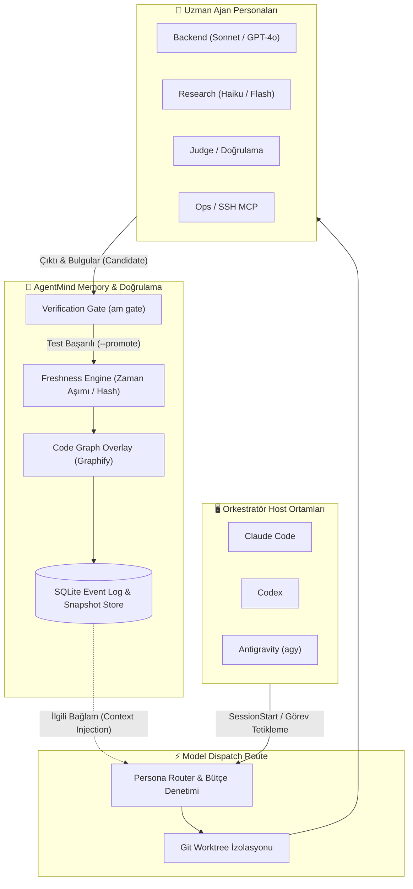

# 🧠 AgentMind + Model Dispatch Route

> **Otonom Ajanlar için Kod Grafı Destekli Hafıza ve Doğrulamalı Multi-Agent Orkestrasyon Çekirdeği**

[](LICENSE)
[](https://www.python.org/)
[](https://github.com/MSelcukAkbas/model-dispatch-route/actions)
[](#-platform-entegrasyonu)

---

## ⚡ Problem & Vizyon

Standart yapay zekâ ajanları **oturumlar arasında unutur**, birbirlerinin bulgularından haberdar olamaz ve kod tabanında oluşturdukları varsayımları (halüsinasyonları) sorgusuz sualsiz doğru kabul edebilir.

**AgentMind + Model Dispatch Route**, bu sorunu kökten çözer:
- 🧩 **Kod Grafı ile Yaşayan Hafıza:** Ajanların iddialarını kod semantiğine (AST / çağrı grafı) bağlar. Kod geliştikçe veya değiştikçe geçerliliğini yitiren iddialar anında `stale` durumuna düşer.
- 🚦 **Doğrulama Kapısı (Verification Gate):** Hiçbir iddia peşinen doğru kabul edilmez. Alt ajanların ürettiği bulgular önce `candidate` (aday) olarak etiketlenir; yalnızca testlerden veya derleme kontrollerinden geçenler `verified` statüsüne terfi ettirilir.
- 🛡️ **İzole Çalışma Ağaçları (Worktree Sandboxing):** Alt modeller doğrudan ana deponuzda değişiklik yapmaz; izole Git worktree'lerinde çalışır. Orkestratör değişiklikleri inceler (`diff`) ve onaylarsa birleştirir (`apply`).

---

## 🏗️ Sistem Mimarisi



---

## 🚀 Öne Çıkan Süper Güçler

### 1. Sıfır Halüsinasyonlu Doğrulama Kapısı (Verification Gate)
Ajanların sunduğu hiçbir çözüm veya iddia körü körüne kabul edilmez:
```bash
# Görevi otomatik çalıştır, test et ve doğrulanırsa hafızaya terfi ettir
am gate <task_id> --check "pytest tests/test_core.py" --promote
```
Eğer hedef dosyalarda commit'lenmemiş değişiklikler varsa veya test başarısızsa iddia reddedilir.

### 2. Canlı ve Kendi Kendini Temizleyen Kod Hafızası (Freshness)
AgentMind, iddiaları dosya hash'leri ve semantik AST düğümleriyle mühürler. Başka bir ajan dosyayı değiştirdiğinde, eski bilgiye dayanan tüm kararlar anında geçersiz kılınır.

### 3. Fail-Open Orkestrasyon
AgentMind veya alt hafıza servisi geçici olarak ulaşılamaz olsa bile ana orkestrasyon (`dispatch`) kilitlenmez; uyarı verir ve işlemi kesintisiz tamamlar.

### 4. Bütçe ve Kota Gözetimi (`quota-watch`)
Her alt modele rolüne göre token veya dolar bütçesi atanır (`maxBudgetUsd`). Bütçesini aşan veya sonsuz döngüye giren modeller otomatik durdurulur.

---

## 📦 Kurulum ve Hızlı Başlangıç

### Gereksinimler
- Python `>=3.12, <3.13`
- [uv](https://docs.astral.sh/uv/) (hızlı Python paket yöneticisi)
- Git ve Node.js `>=18`

### 1. AgentMind Çekirdeğini Kurun
```bash
# Python çekirdeğini ve graf eklentisini kurun
uv tool install --editable "./skills/model-dispatch-route/mcp/agentmind[graph]" --force
```

### 2. Platform Kancalarını (Hooks) Aktif Edin
Tek komutla desteklenen tüm araçlarınıza (`Claude Code`, `Codex`, `Antigravity`) bellek yaşam döngüsü kancalarını entegre edin:
```bash
# Tüm platformlar için kancaları bağlayın
am hooks-install . --platform all
```

> **Not:** Kanca yükleyici mevcut ayarlarınızı ezmez; AgentMind oturum kancalarını akıllıca birleştirir.

### 3. Konfigürasyonu Özelleştirin
Şablon yapılandırmayı projenizin kök dizinine kopyalayın:
```bash
cp packaging/agentmind-model-dispatch-route/examples/model-dispatch-route.example.json .model-dispatch-route.json
```

---

## 🎮 Platform Entegrasyonu

| Platform | Entegrasyon Tipi | Konum / Dosya | Yetenekler |
|---|---|---|---|
| **Antigravity (`agy`)** | Eklenti Manifesti / Hooks | `.agents/plugins/marketplace.json` | Oturum öncesi hafıza yükleme, arka plan alt-ajan dispatch |
| **Claude Code** | Session Lifecycle Hooks | `.claude/settings.json` | Oturum başlangıcı/bitişi bellek senkronizasyonu |
| **Codex** | Codex Plugin / Hooks | `.codex/hooks.json` | Otonom rol yönlendirme, worktree sandbox |

---

## 📂 Dizin Mimarisi

```
agentmind/
├── skills/model-dispatch-route/       # 🧠 Ana Skill & Orkestrasyon Çekirdeği
│   ├── SKILL.md                      # Skill spesifikasyonu & agent talimatları
│   ├── personas/                     # Rol tanımları (backend, judge, research, ops, agy)
│   ├── scripts/                      # Dispatch, worktree, diff & apply betikleri
│   ├── mcp/agentmind/                # Python çekirdeği (SQLite, Graphify, CLI, Server)
│   └── mcp/bridge/                   # Node.js Agent Bridge & Ollama embedding köprüsü
├── packaging/                         # 📦 Dağıtım & Eklenti Paketleme
│   ├── agentmind-model-dispatch-route/ # Standart eklenti şablonu
│   └── build.mjs                     # Dağıtılabilir eklenti derleyici
├── references/                        # 🔗 Submodule & Harici Entegrasyonlar
│   └── agentic-ssh-mcp               # SSH araçları entegrasyonu (Git Submodule)
├── docs/                             # 📚 Mimari & Karar Dokümanları
│   └── AGENTMIND_STATE.md            # Bellek motoru durum takibi
├── .github/workflows/ci.yml           # 🧪 Çoklu platform (Linux & Windows) CI
└── LICENSE                            # ⚖️ MIT Lisansı
```

---

## 🧪 Test ve Kalite Güvencesi

Birim testlerini yerel ortamda çalıştırmak için:
```bash
cd skills/model-dispatch-route/mcp/agentmind
uv sync --extra graph --group dev
uv run pytest -q
```

Taze kullanıcı kurulumu duman testini (Smoke Test) çalıştırmak için:
```bash
bash skills/model-dispatch-route/scripts/smoke-test.sh
```

---

## 📄 Lisans

Bu proje **[MIT Lisansı](LICENSE)** ile lisanslanmıştır. Topluluk katkılarına, ticari ve bireysel kullanıma açıktır.
