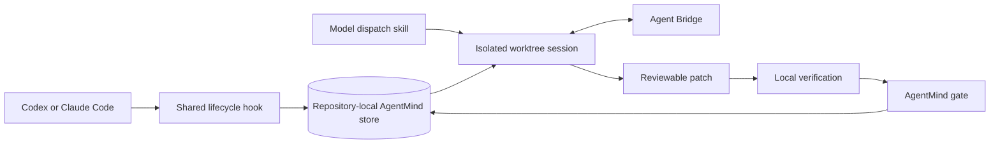

# AgentMind architecture

AgentMind is the repository-memory layer beneath the `model-dispatch-router` skill.
It keeps model output traceable to code, supplies bounded context to later
sessions, and refuses to treat an agent statement as verified evidence without
a local gate.

## Components

| Component | Responsibility |
| --- | --- |
| `skills/model-dispatch-router/SKILL.md` | Orchestrator workflow and safety boundaries |
| `scripts/dispatch.sh` | Isolated model process and worktree lifecycle |
| `mcp/bridge` | Live orchestrator-to-agent questions and results |
| `mcp/agentmind` | SQLite event log, code-linked claims, context, hooks, and gate |
| `.codex/hooks.json` | Codex session lifecycle adapter |
| `.claude/settings.json` | Claude Code session lifecycle adapter |
| `.mcp.json` | Claude Code project MCP registration |

## Data flow

Corpus identity is derived from the resolved repository source path, not from a
human label or a global default. Runtime stores, snapshots, logs, worktrees,
local role configuration, accounts, and credentials are excluded from Git.

## Verification invariant

New claims are candidates. Promotion requires cited files to exist, citations
to resolve against the code graph, evidence to be committed and current, and
the configured repository verification command to pass. Applying a patch queues
the gate; a later session finalizes it only after the checkout is clean.

## Current packaging boundary

This repository contains a portable skill, MCP server, and host-specific hook
configurations. A marketplace/plugin manifest and publication workflow are a
separate delivery step and are intentionally not implied by the runtime code.

## Distribution posture

Two things a reader may mistake for unfinished work are settled decisions.

**Open-source licence.** The project is released under the MIT License (`LICENSE`).

**Git remote and CI.** The repository is hosted at `https://github.com/MSelcukAkbas/model-dispatch-router`. Continuous integration runs via `.github/workflows/ci.yml`. Local checks can be run via `uv run pytest -q` inside `skills/model-dispatch-router/mcp/agentmind` and `bash skills/model-dispatch-router/scripts/smoke-test.sh`.

