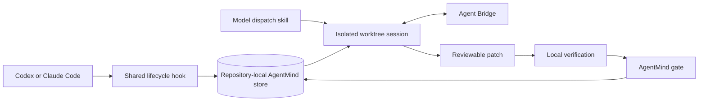

# AgentMind architecture

AgentMind is the repository-memory layer beneath the `model-dispatch` skill.
It keeps model output traceable to code, supplies bounded context to later
sessions, and refuses to treat an agent statement as verified evidence without
a local gate.

## Components

| Component | Responsibility |
| --- | --- |
| `skills/model-dispatch/SKILL.md` | Orchestrator workflow and safety boundaries |
| `scripts/dispatch.sh` | Isolated model process and worktree lifecycle |
| `mcp/bridge` | Live orchestrator-to-agent questions and results |
| `mcp/agentmind` | SQLite event log, code-linked claims, context, hooks, and gate |
| `.codex/hooks.json` | Codex session lifecycle adapter |
| `.claude/settings.json` | Claude Code session lifecycle adapter |
| `.mcp.json` | Claude Code project MCP registration |

## Data flow

Corpus identity is derived from the resolved repository source path, not from a
human label or a global default. Runtime stores, snapshots, logs, worktrees,
local role configuration, accounts, and credentials are excluded from Git.

## Verification invariant

New claims are candidates. Promotion requires cited files to exist, citations
to resolve against the code graph, evidence to be committed and current, and
the configured repository verification command to pass. Applying a patch queues
the gate; a later session finalizes it only after the checkout is clean.

## Current packaging boundary

This repository contains a portable skill, MCP server, and host-specific hook
configurations. A marketplace/plugin manifest and publication workflow are a
separate delivery step and are intentionally not implied by the runtime code.

## Distribution posture

Two things a reader may mistake for unfinished work are settled decisions.

**No open-source licence.** `LICENSE` states all rights reserved. The project
is kept as an internal tool; replacing that file with MIT or Apache-2.0 is the
only step required to open it later.

**No git remote.** `.github/workflows/ci.yml` is written and waits for a push.
Until then the same two checks run locally: `uv run pytest -q` inside the
package, and `bash scripts/smoke-test.sh` from the repository root. Both were
also executed against a Linux container so that the platform the workflow
names is proven rather than assumed; the invocation is recorded in the smoke
test's header.

Neither decision is load-bearing for the code, and both are reversible.
